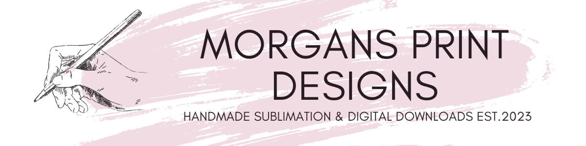

This essay aims to provide an overview of my experience during the development of my Art Website project. From week one through week five, this project involved planning, implementation, testing, and evaluation. This essay will reflect on what challenges I faced week to week, what I was able learn, and the outcome of the project.
I remember being initially stressed out about the project, looking at the assignment for Week 1 trying to choose which type of project I wanted to do was difficult. I’ve never had to do something like this project before, so it was all new to me. I ended up choosing the website because HTML and CSS is something that I have little experience in, but I’ve played around with it before, and it was kind of interesting. After I decided to develop a website, I started thinking about ideas of what I wanted to create. I ended up choosing an art site because my wife is an artist and I thought it was fun to try and make her a little site. 
Towards the end of the first week and the start of the second week I spent some time researching on what software I should use to develop the site. After finding the program I wanted to use, I started developing a design direction. I started planning how I wanted the site to look and trying to meet the requirements of the assignment. There was a lot that needed to be done so I started creating some of the simpler parts of the home page during the later half of the second week and into the third week. 
During the third week of the project, I felt like I was getting a better understanding of HTML, and the home page was coming together. During the week I started to try and add some simple CSS elements to the page, but it wasn’t going as planned at first. I ended up taking a break from the CSS parts and started working on the HTML of the other pages while I did some more research on CSS and how to write it properly. I needed to get the other pages started anyways to make sure the navigation bar was going to work as well.
Going into week four I was still having a difficult time with the CSS and how to format the site. I had to do a lot of testing with the different values to get everything I wanted. It was the most difficult week of the whole project for me. I think I learned the most during this week compared to the other weeks. There was a lot of trial and error to get everything right. I did manage to finish up all pages of the site and made sure the pictures were displaying properly.
The final week of the project was mostly just testing and evaluation. Testing was done to ensure the website met all the requirements and everything was functioning as intended. I got some feedback for my wife about the site and decided to fix a couple of small things but overall, it was a good week because I was able to tweak the site a bit more until I was satisfied.
Overall, I enjoyed doing this project. The challenges I faced when it came to coding were a good learning experience for me. I was able to learn more than I thought about HTML 5, CSS, and website development. 

